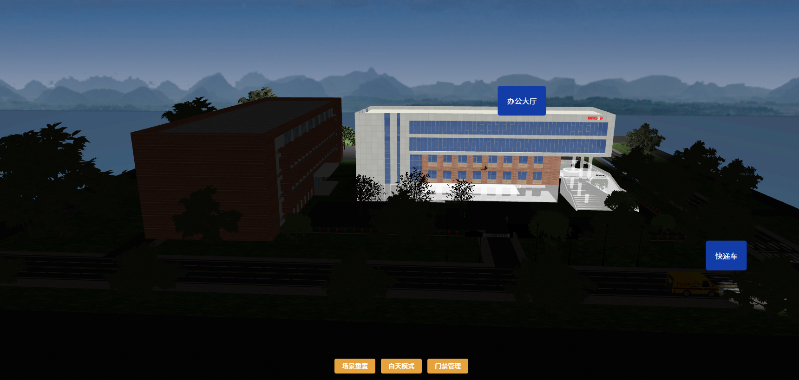
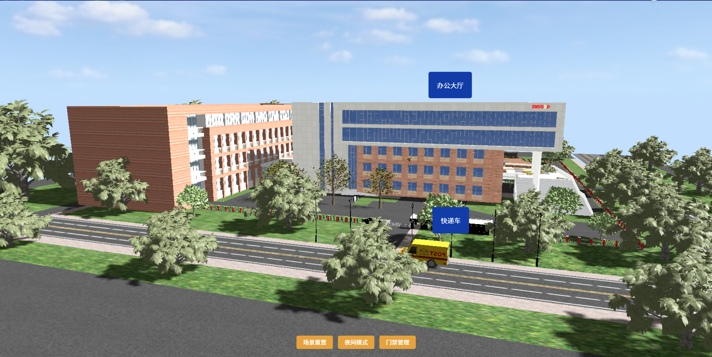

## vite + vue3 + ThreeJs

### 项目简介

这是一个基于 Vue3 + Three.js + Vite 开发的园区 3D 可视化项目，主要功能包括：

楼层交互：点击办公大厅即可分层展示、弹出详细信息。

动态场景：包含持续行驶的快递车、自由飞行的鸟类。

环境切换：支持白天与夜间模式的无缝切换，营造不同氛围效果。

人物交互：实现人物在园区中的自由移动与交互体验。

# 示例如下





# 安装依赖

```bash
npm install
```

# 运行项目

```bash
npm run dev
```
